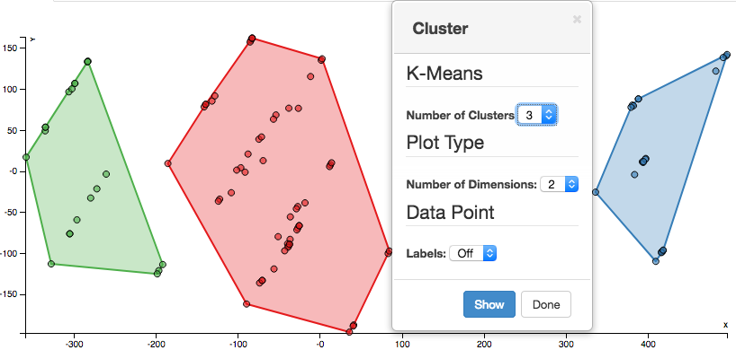
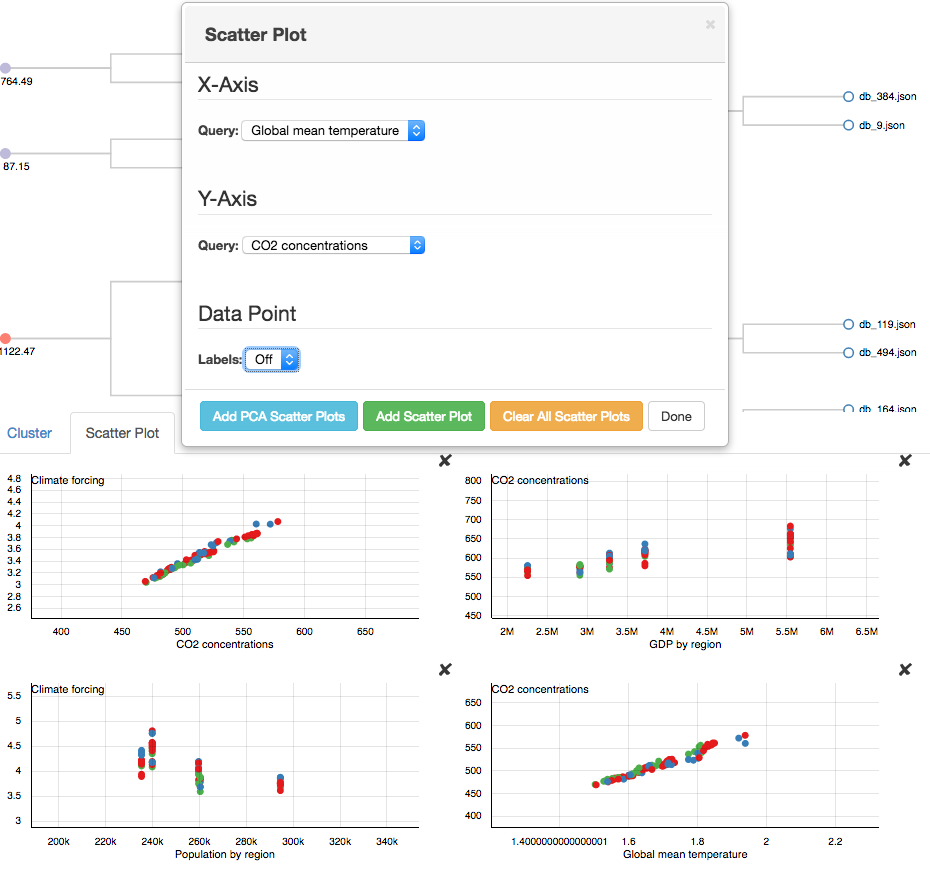
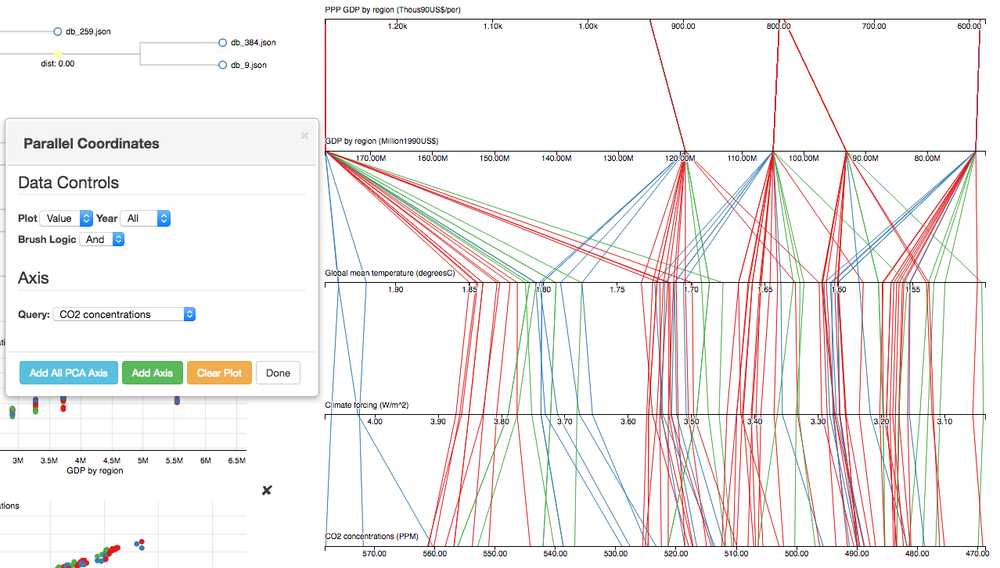

Tutorial Analysis Page
==================

.. image:: images/tutorial/analyze/overview.png

Components
-----------------

The Analysis Page can be broken into the following components,
each component has a dialog menu that can be opened by clicking the relevant tab at the top of the page:

1.  Dendogram View - This view shows the results of hierarchical clustering performed on the current job for all features.
    The nodes are colored based on which input feature has the greatest difference at a particular level in the tree.

2.  Cluster View - This view shows the K-Means clustering results for the current job for all features.
    The points and hulls are colored based on their corresponding clusters.

3.  Scatter Plot - This view shows scatter plots of the databases in the current job plotted on selected X and Y axis.
    The points are colored based on their corresponding clusters from the Cluster View.

4.  Parallel Coordinates Plot - This view shows the databases in the current job plotted on the selected axes.
    The lines are colored based on their corresponding clusters from the Cluster View.

1) Dendogram View
-----------------

.. image:: images/tutorial/analyze/dendogram.png

This view shows the results of hierarchical clustering performed on the current job for all features.
The nodes are colored based on which input feature has the greatest difference at a particular level in the tree.
This view is explorable through pan and zoom interactions.
The tail nodes are named based on the database file that they represent.
Distances are labeled on parent nodes as dist: value.
The dialog menu for this view has controls to jump from the root (head) node and to the tail (last) node.
The dialog menu also has a legend for the input coloring.

2) Cluster View
-----------------

This view shows the K-Means clustering results for the current job for all features.
The points and hulls are colored based on their corresponding clusters.
By clicking on either the points or the hulls, the corresponding databases in the Parallel Coordinates Plot will be unhighlighted/highlighted.
By hovering over a data point the name of the database that it represents will be displayed in the view.
The dialog menu allows for the selection of the number of clusters to be used in the K-Means analysis.
The dialog menu also provides a control to switch between a 2 dimensional and 3 dimensional plot.
When finished making adjustments to the settings in the dialog menu click the "Show" button for the updates to take place.
There is also a control for the labels of the databases to stay in view, however this may be undesirable if there are many databases.

3) Scatter Plot
-----------------

This view shows scatter plots of the databases in the current job plotted on selected X and Y axis.
The points are colored based on their corresponding clusters from the Cluster View.
By clicking on the points the corresponding databases in the Parallel Coordinates Plot will be unhighlighted/highlighted.
By hovering over a data point the name of the database that it represents will be displayed in the view.
The dialog menu allows for the selection of the X and Y axis of new scatter plots to be added.
After selecting the desired X and Y axis from the drop-down menus click the "Add Scatter Plot" button to add the scatter plot.
Use the "Clear All Scatter Plots" button to remove all scatter plots from the view.

4) Parallel Coordinates Plot
-----------------------------

This view shows the databases in the current job plotted on the selected axes.
The lines are colored based on their corresponding clusters from the Cluster View.
Brush on the desired axis to unhighlight/highlight irrelevant/relevant databases.
The dialog menu allows for the selection of the type of 'Plot' to be displayed (Value/Slope),
the 'Year' to be used in the analysis (All [average] or a specific year in the simulation),
and the 'Brush Logic'.
To add a new axis to the plot, select the desired feature from the drop-down menu and click the "Add Axis" button.
Use the "Clear Plot" button to remove all axes from the view.
