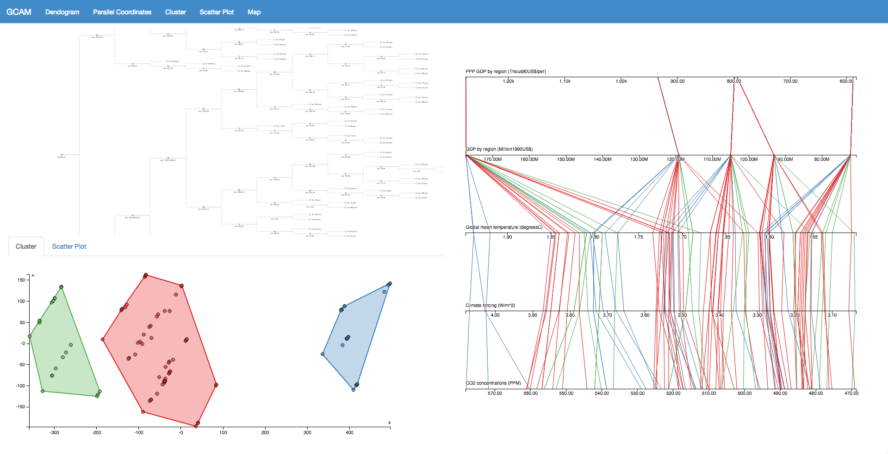

Tutorial Analysis Page
==================

Components
-----------------

The Analysis Page can be broken into the following components,
each component has a dialog menu that can be opened by clicking the relevant tab at the top of the page:

1.  Dendogram View - This view shows the results of hierarchical clustering performed on the current job for all features.
    The nodes are colored based on which input feature has the greatest difference at a particular level in the tree.

2.  Cluster View - This view shows the K-Means clustering results for the current job for all features.
    The points and hulls are colored based on their corresponding clusters.

3.  Scatter Plot - This view shows the databases in the current job plotted on the selected X and Y axis.
    The points are colored based on their corresponding clusters from the Cluster View.

4.  Parallel Coordinates Plot - This view shows the databases in the current job plotted on the selected axes.
    The lines are colored based on their corresponding clusters from the Cluster View.

1) Dendogram View
-----------------

.. image:: images/tutorial/analyze/dendogram.png

This view shows the results of hierarchical clustering performed on the current job for all features.
The nodes are colored based on which input feature has the greatest difference at a particular level in the tree.

